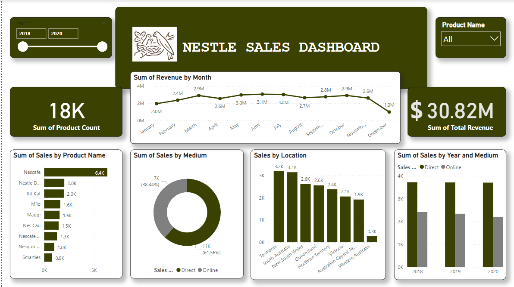

# Nestle-Sales-Analysis

## Table of Contents

- [Project Overview](#project-overview)
- [Data Source](#data-source)
- [Tools](#tools)
- [Data Cleaning and Preparation](#data-cleaning-and-preparation)
- [Exploratory Data Analysis](#exploratory-data-analysis)
- [Result And Findings](#result-and-findings)
- [Recommendations](#recommendations)
- [Limitations](#limitations)
- [References](#references)
- [Recommendations](#recommendations)

## Project Overview

This data analysis project aims to provide insight into the sales performance of Nestle Food Company over the past year. By analysing various aspect of sales data, I seek to indentify trends, make data-driven recommendations, and gain a deeper understanding of the company's performance.

### Data Source

Sales Data: The primary dataset used for this analysis is the 'sales_data.csv' file, containing datailed information about each sales made by the company.

### Tools

- Excel - Data Cleaning
   - [Download Here]()
- Powerbi - Data Visualisation

### Data Cleaning and Preparation

In the initial data preparation phase, I performed the following task:
1. Data Loading and Inspection
2. Handling missing values
3. Data cleaningand formating

### Exploratory Data Analysis

EDA Involved exploring the sales data to answer key questions, such as:

Which location sold the most?
Which year made more revenue?
Which Product sold the most?

### Result and Findings

### Recommendations

### Limitations

### References 
